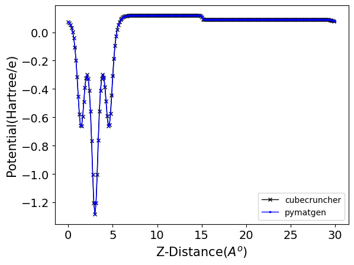

## Overview
Two Folders "LiMoS2_hartree_potential " and "TiS2_hartree_potential" contain cp2k output files and `pmg_cube_test.py`, which parses output files generated by CP2K, using `pymatgen` for processing and benchmarking. The files involved in this process include `run.out`, and  `run-Hartree-v_hartree-1_0.cube`. The parsed data is then compared against results from the `cubecruncher` tool 

## Process Steps

1. **Parsing CP2K Output Files:**

   - The main output file `run.out` is parsed using the `pymatgen.io.cp2k.output` module.
   - The `run-Hartree-v_hartree-1_0.cube` file is also parsed using the same module.

2. **Data Conversion to Pymatgen VolumetricData:**

   - The parsed data is converted into `pymatgen`'s `VolumetricData` format.

3. **Computing Planar Average:**

   - The `VolumetricData` object has a function to compute the planar average.
   - This computed planar average is then compared with the results from the `cubecruncher` tool.

4. **Benchmark Comparison:**

   - The comparison results are stored in `profile_int_3.dat`.
   - The benchmarking results are visualized and saved as a PNG file.

## File Details

- **Main Output File:**
  - `run.out`

- **Cube File:**
  - `run-Hartree-v_hartree-1_0.cube`

- **Benchmark Data:**
  - `profile_int_3.dat`

- **Benchmark Visualization:**
- Planar averaged Hartree potential for LiMoS2{orthorhombic cell} along the vacuum direction 
  
  


## Code Snippet (Example)

Here's an example code snippet for parsing the CP2K output and computing the planar average:

```python
from pymatgen.io.cp2k.outputs import Cp2kOutput
from pymatgen.core import VolumetricData

# Parse the CP2K main output
cp2k_out = Cp2kOutput('run.out')

# Parse the cube file
vol_data=cp2k_out.parse_cube()

# Compute the planar average
planar_avg = vol_data.get_average_along_axis(ind=2)  # Assuming z-axis

# Benchmarking with cubecruncher tool results
with open('profile_int_3.dat', 'r') as f:
    cubecruncher_data = [float(line.strip()) for line in f]

# Comparison and benchmarking (this is a conceptual representation)
benchmark_results = compare_planar_average(planar_avg, cubecruncher_data)

# Visualization (pseudo-code)
visualize_benchmark(benchmark_results, output_file='benchmark.png')

